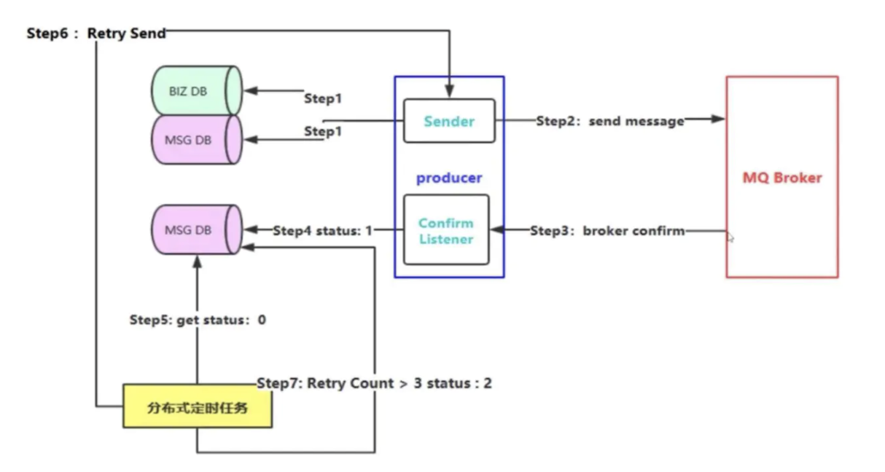

# RabbitMq数据可靠性投递解决方案

默认情况下，消息发送端发送消息给 RabbitMQ 后，RabbitMQ 是不会返回任何信息的。
那么我们怎么知道消息是中途丢失了还是到达了 broker 呢？
RabbitMQ 提供了两种确认消息是否投递成功的方法

* 设置 channel 为 transaction 模式，通过 AMQP 事务机制实现，这也是 AMQP 协议层面提供的解决方案
* 设置 channel 为 confirm 模式，这是 RabbitMQ 提供的解决方案

由于分布式事务会极大降低性能，生产环境一般不用。这里通过第二种方式实现可靠性投递。

**Confirm模式**
生产者通过调用 channel 的 confirmSelect 方法将 channel 设置为 confirm 模式. 该模式下，所有在该信道上发布的消息都会被分派一个唯一的ID(从1开始)，当消息被投递到所有匹配的队列后，broker 就会发送一个(包含消息的唯一 ID 的)确认给发送端，
如果 RabbitMQ 因为自身内部错误导致消息丢失，就会发送一条nack消息，发送端的 Confirm Listener 会去监听应答

**数据落库，消息状态打标**

如图

- step1: 发送业务消息前，先将业务数据和消息状态入库，并将消息状态初始化为**发送中**
- step2: 发送业务消息，设置超时时间，同时异步监听 RabbitMQ 响应
- step3: RabbitMQ 返回响应
- step4: 根据响应结果，更新消息状态，投递成功则将消息状态设置成**成功**
- step5: 定时任务找出状态为**发送中**，且时间超时的
- stem6: 重新投递
- stem7: 经过上述步骤多次(通常是3次)循环后，依然失败的，设置消息状态为**失败**
- stem8: 人工去解决状态为**失败**的消息

----

本案例是基于以上方案实现。

